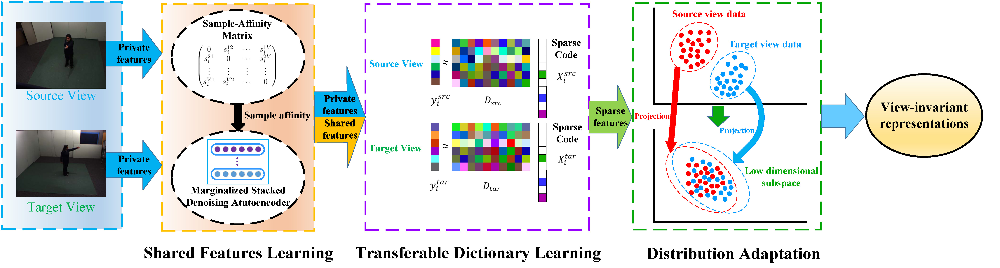
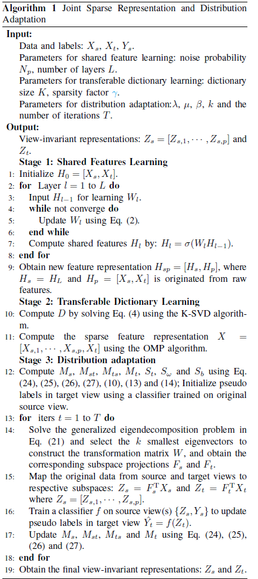
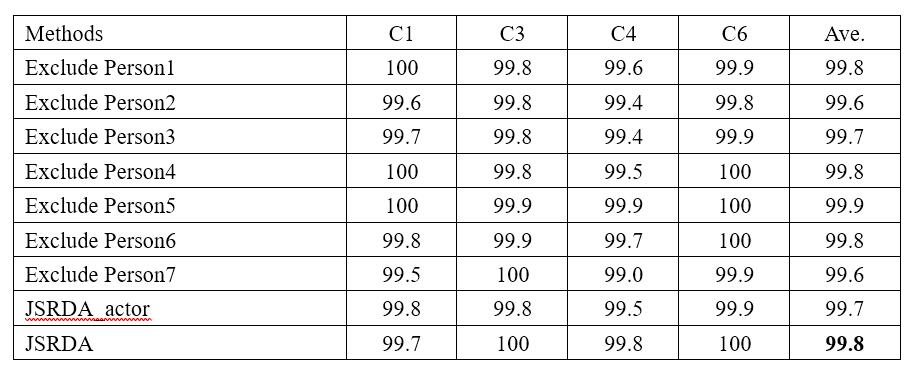
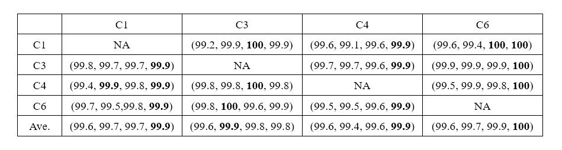
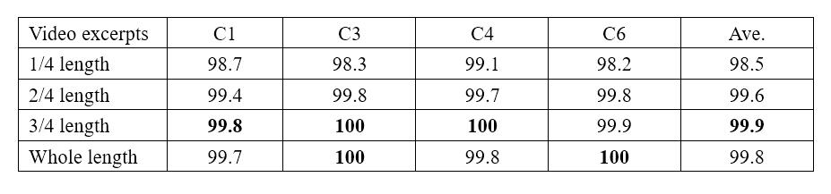
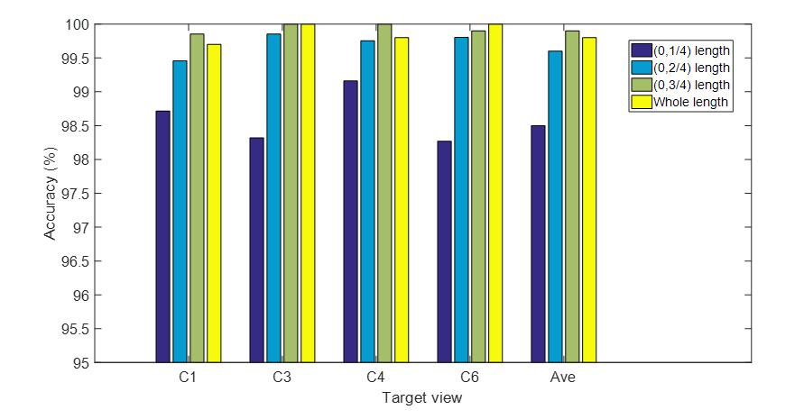
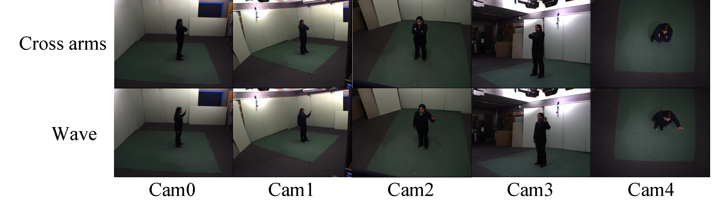
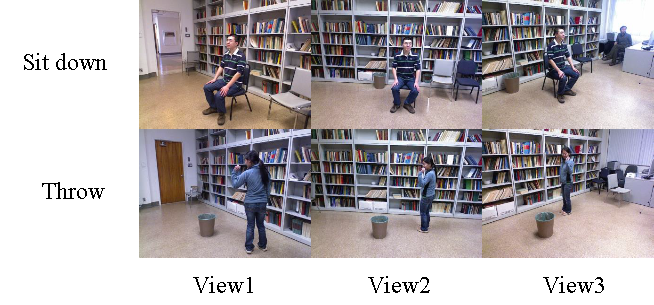
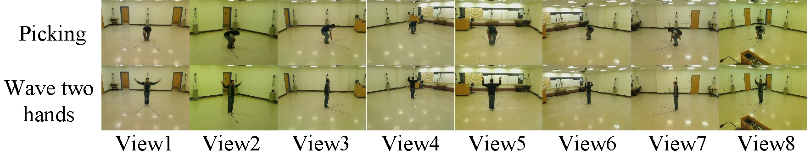
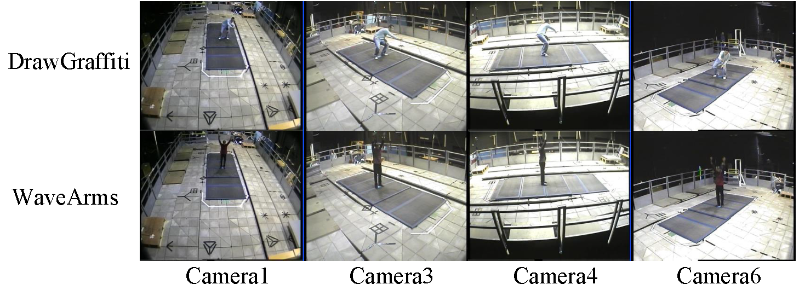

# Hierarchically Learned View-Invariant Representations for Cross-View Action Recognition

<a href="https://orcid.org/0000-0002-9423-9252" target="orcid.widget" rel="noopener noreferrer" style="vertical-align:top;">orcid.org/0000-0002-9423-9252</a>

Homepage: [https://sites.google.com/site/yangliuxdu/home]([https://sites.google.com/site/yangliuxdu/home)

Methods and results for paper "Hierarchically Learned View-Invariant Representations for Cross-View Action Recognition"

## Abstract
Recognizing human actions from varied views is challenging due to huge appearance variations in different views. The key to this problem is to learn discriminant view-invariant representations generalizing well across views. In this paper, we address this problem by learning view-invariant representations hierarchically using a novel method, referred to as Joint Sparse Representation and Distribution Adaptation (JSRDA). To obtain robust and informative feature representations, we first incorporate a sample-affinity matrix into the marginalized stacked denoising Autoencoder (mSDA) to obtain shared features, which are then combined with the private features. In order to make the feature representations of videos across views transferable, we then learn a transferable dictionary pair simultaneously from pairs of videos taken at different views to encourage each action video across views to have the same sparse representation. However, the distribution difference across views still exist because a unified subspace where the sparse representations of one action across views are the same may not exist when the view difference is large. Therefore, we propose a novel unsupervised distribution adaptation method that learns a set of projections that project the source and target views data into respective low-dimensional subspaces where the marginal and conditional distribution differences are reduced simultaneously. Therefore, the finally learned feature representation is view-invariant and robust for substantial distribution difference across views even the view difference is large. Experimental results on four multi-view datasets show that our approach outperforms the state-of-the-art approaches.

## Model

Figure 1: Framework of our proposed JSRDA. The framework is hierarchical as the view-invariant representation is learned in a coarse-to-fine fashion. 

## Algorithm




## Experimental results 

Detailed expermental results and related disscussions can be found in the paper.
Here, we provide some extra experiments and results which are not included in the original paper.

### Experiment 1
Regarding the partioning of the datasets, it appears that samples of the same video/action are in both training and testing partitions. Therefore, we have conducted an experiment where the same action performed by the same actor does not appear in both training and testing partitions. That way, it'll be possible to understand if the proposed solution is able to generalize both the view and the action class, avoiding the possibility that the actions are being identified by memorization of appearance and motion cues that were present during training. 

To evaluate the performance of our method when the same action performed by the same actor does not appear in both training and testing partitions, we use the leave-one-actor-out strategy for training and testing which means that each time one actor is excluded from both training and testing procedure. We report the classification accuracy by averaging all possible combinations for excluding actors. We conduct experiments for multi-view action recognition task on the MuHAVi dataset. This dataset contains 17 action classes and each action is performed by 7 actors. To reduce the computational burden and have a fair comparison with other works, we follow (J. Zheng, Z. Jiang, and R. Chellappa, “Cross-view action recognition via transferable dictionary learning,” IEEE Trans. Image Processing, vol. 25, no. 6, pp. 2542–2556, 2016) and (X. Wu and Y. Jia, “View-invariant action recognition using latent kernelized structural SVM,” in ECCV 2012, pp. 411–424) to choose the action videos captured by four cameras (C1, C3, C4, C6) in our experiments. Table 1 shows the experimental results.


Table 1: Performance comparison of multi-view action recognition task on the MuHAVi dataset for different combinations for excluding actors. C1, C3, C4 and C6 denote Camera 1, Camera 3, Camera 4 and Camera 6 respectively.

From this table, we can see that the performance of our method using leave-one-actor-out strategy (JSRDA_actor) is comparable to that of our method using leave-one-action-class-out strategy (JSRDA). This verifies that our method can generalize both the view and the action class. 

### Experiment 2
To evaluate how our method performs in untrimmed videos. We conudcted experiments on excerpts of the video with fixed length durations and integrating the results over time. 

Compared with datasets like the IXMAS, the NUMA and the WVU, videos from the MuHAVi dataset usually last longer (range from 15 seconds to 120 seconds). Therefore, we conducted experiments on the MuHAVi dataset by cutting each video into four excerpts: (0, 1/4), (0, 2/4), (0, 3/4) and the whole length of the video, to provide an insight how well our method could perform in untrimmed videos. Then we evaluated the performance of each kind of video excerpt for both cross-view and multi-view action recognition tasks on the MuHAVi dataset. Table 2 and Table 3 show the experimental results of cross-view problem and multi-view problem respectively.


Table 2: Cross-view action recognition results of different excerpts of the video on the MuHAVi dataset under unsupervised mode. Each row corresponds to a training view and each column a testing view. The four accuracy numbers in the bracket are the average recognition accuracies of our method with the 1/4 length, the 2/4 length, the 3/4 length and the whole length of the video respectively.


Table 3: Performance comparison of multi-view action recognition task on the MuHAVi dataset for different excerpts of the video. C1, C3, C4 and C6 denote Camera 1, Camera 3, Camera 4 and Camera 6 respectively.


Figure 2: Performance comparison of multi-view action recognition task on the MuHAVi dataset for different excerpts of the video. C1, C3, C4 and C6 denote Camera 1, Camera 3, Camera 4 and Camera 6 respectively. Ave denotes the average accuracy of these views.

From Table 3, we can see that our method with the whole length of video achieves the best performance in 9 out of 12 combinations and the overall performance is slightly better than other three kind of video excerpts when the target view is C1, C4 and C6. Nevertheless, the performance of other three video excerpts is comparable to that of the whole length of video. Especially when the target view is C3, the whole length of video achieves slightly worse performance than other three video excerpts. To be noticed, the overall performance of these four kinds of video excerpts is satisfactory. These validate that our method can achieve reasonable performance for cross-view problem in video excerpts of both small and large length. 

From Table 4, we can see that the performance of our method with 1/4 length of the video achieves slightly worse performance that other three video excerpts. Nevertheless, the overall performance of these four kinds of video excerpts is satisfactory. More intuitive comparison can be seen in Figure 2 below. We can see that the performance increases when the length of video excerpts increases. This validates that cutting each video into small excerpts will degrade the performance because the excerpts of the video may break the whole process of an action. To be noticed, our method with 3/4 length of the video achieves slightly better performance than the whole video length. This may due to the fact that the whole video excerpt may contain more redundant information because videos on the MuHAVi dataset not only contain the action of interest but also the background information before and after the action process. Although our method with the 3/4 length of the video achieves the best performance, the overall performance of our method with the whole length of the video is comparable to it. In addition, the average accuracy gap among different kind of video excerpts is small, this validates that our method can achieve reasonable performance for multi-view problem in video excerpts of both small and large length. 

### Experiment 3

We use c=2 in all the experiments in our paper to calculate the Gaussian distances in Shared features learning  part. To evaluate whether the value of parameter c influence the overall performance of our algorithm, we choose different values of parameter c to evaluate our algorithm. We conduct experiment on MuHAVi dataset for cross-view task Cam1|Cam3. The results of other cross-view action recognition tasks or multi-view tasks are not given here as it shows similar results to the Cam1|Cam3. The experimental result can be seen in Table 4.

Table 4: Performance comparison of cross-view action recognition task Cam1|Cam3 on the MuHAVi dataset for different values of parameter c.


From Table 4, we can see that the overall performance of our algorithm is stable when. But when the value of c is too small or too big, the overall performance of our algorithm drops a little. Therefore, we choose c=2 according to this experimental result and the paper titled (*F. Zhu and L. Shao, “Weakly-supervised cross-domain dictionary learning for visual recognition,” International Journal of Computer Vision, vol. 109, no. 1-2, pp. 42–59, 2014*)*.* Due to the limited size of the paper, this experimental result will not be provided in the original paper. 


### Datasets

### IXMAS dataset can be downloaded [here](http://4drepository.inrialpes.fr/public/viewgroup/6#sequence37).



Figure 3: Exemplar frames from the IXMAS dataset. Each row shows one action captured by five cameras.

### Northwestern UCLA Multiview Action 3D (NUMA) dataset can be downloaded [here](http://users.eecs.northwestern.edu/~jwa368/my_data.html).



Figure 4: Exemplar frames from the Northwestern UCLA dataset. Action classes: Sit down and Throw.

### WVU action datase can be downloaded [here](http://csee.wvu.edu/~vkkulathumani/wvu-action.html).



Figure 5: Exemplar frames from the WVU dataset. Each row shows one action viewed across eight camera views.

### MuHAVi dataset can be downloaded [here](http://dipersec.king.ac.uk/MuHAVi-MAS/).



Figure 6: Exemplar frames from the MuHAVi dataset. Action classes: DrawGraffiti and WaveArms.

### Codes
Soon will be available.

If you find the work helpful, please kindly consider to cite our paper by:
```

```
### Reference
Yang, Liu; Zhaoyang, Lu; Jing, Li; Tao, Yang. Hierarchically Learned View-Invariant Representations for Cross-View Action Recognition. IEEE Transactions on Circuits and Systems for Video Technology, accepted.

If you have any question about this code, feel free to reach me(aryanr@163.com)

<a href='https://clustrmaps.com/site/1a4an'  title='Visit tracker'></a>
